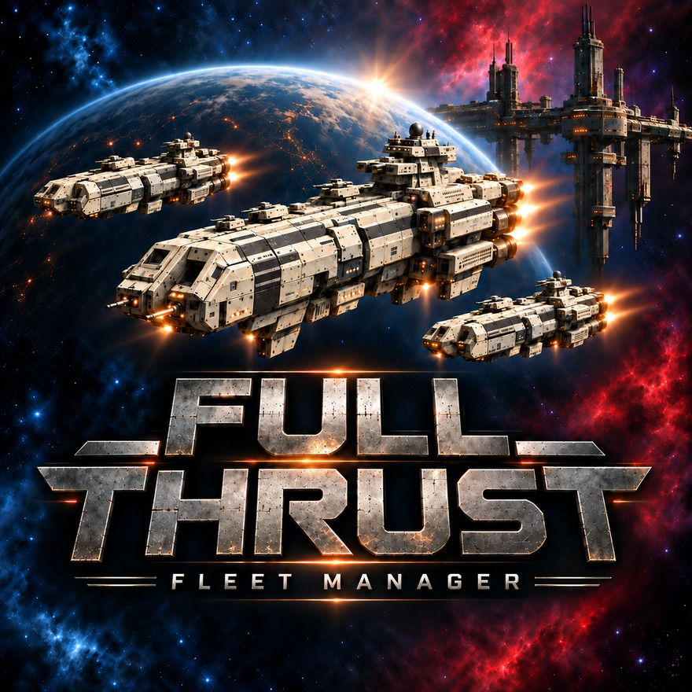

# Full Thrust Fleet Manager

Fleet management tool for the *Full Thrust* starship wargame (Ground Zero Games): design ships,
build fleets to a points limit, track campaign damage, and print a fleet PDF for the table.
Supports the Full Thrust 2nd edition and Fleet Book rulesets; Cross Dimensions and Project
Continuum later.

[](https://therealdeltrex.github.io/FullThrustFleetManager/)

**Just want to use it? Go to the [download page](https://therealdeltrex.github.io/FullThrustFleetManager/)**
to play in your browser or download the Windows build, no code needed. You can also take the
[latest release](../../releases/latest) directly.

**Status:** v0.2, adding the Fleet Book 2 alien races (Kra'Vak, Sa'Vasku and Phalon).
Licensed GPL-3.0; Ground Zero Games content notice in [NOTICE.md](NOTICE.md), full build
plan in [docs/PLAN.md](docs/PLAN.md).

## What it does

- **Design ships** to the Fleet Book or Full Thrust 2nd edition rules, with live MASS and NPV,
  an arc picker and a rules check. Break the rules deliberately if you want to; the design is
  then marked non-conforming.
- **Build fleets** to a points limit, in squadrons, from your own designs or the 96 ship classes
  of the books, with a tournament check that lists every violation.
- **Track a campaign**: damage marked by clicking the ship diagram, crew factors, repairs and
  replenishment, a fleet log.
- **Print** a fleet pack or a two-fleet battle pack: roster, record sheets, orders chart,
  ordnance tracker and a quick reference in the rulebooks' own wording.
- **Read the rulebooks** in the app, with every page reference in the UI linking into them.

Everything runs locally: no account, no server, plain JSON files you can back up and share.

## Getting it

- **Windows:** download the zip from the [latest release](../../releases/latest), unpack it
  anywhere and run `FullThrustFleetManager.exe`. It needs no installation and works offline;
  your library lives in `%APPDATA%\FullThrustFleetManager`.
- **Linux:** download the tarball from the release the download page points at, `chmod +x` it
  and run it. Linux builds are occasional rather than one per version.
- **In the browser:** the same app (landing page at the site root, the app under `app/`) runs
  on GitHub Pages via Pyodide. Nothing is uploaded; the library is stored in that browser only,
  so export a backup file to keep it. The landing page also carries read-only previews of a
  design and a fleet, for looking before installing anything.

## Running from source

Needs Python 3.11 or newer.

```bash
python -m venv .venv
.venv/Scripts/python.exe -m pip install -r requirements-dev.txt
.venv/Scripts/python.exe app.py
```

Then open <http://127.0.0.1:5000/>. Data is kept in `userdata/` next to the checkout; set
`FTFM_DATA_DIR` to put it elsewhere.

## Building

- **Windows desktop app:** `pyinstaller fleetmanager.spec`, output in `dist/`. Runs fully
  offline.
- **Linux desktop app:** the "Build Linux" GitHub Action runs `fleetmanager-linux.spec`
  (onefile, no tray icon), smoke-tests the binary and attaches it to a release on request.
- **Web build:** `python scripts/build_browser_bundle.py` writes `web/bundle.json`; the
  "Deploy Pages" GitHub Action builds the site, renders the preview pages from the real app
  and publishes the lot.
- **Tests and lint:** `python -m pytest`, `ruff check .`.

## Rulebooks (`rulebooks/`)

The app ships clean, searchable, bookmarked copies of the four core books, prepared from the
PDFs Ground Zero Games sells, so that every page reference in the app opens the right page.
Every page renders identically to the original; the work was on the text layer and the
bookmarks:

| Book | Text layer |
|---|---|
| `Full Thrust.pdf` | image-only scan, Tesseract OCR added as an invisible layer over the untouched pages |
| `More Thrust.pdf` | native text, fake-bold overprints hidden |
| `Fleet Book 1.pdf` | native text, overprints hidden |
| `Fleet Book 2.pdf` | native text, overprints hidden |

Bookmarks follow each book's contents page; the Fleet Books also have one bookmark per ship
class under each fleet's "Ship Designs" entry.

The pipeline that produces them is in `tools/` (`build_rulebooks.py`, with bookmark lists in
`tocs.py` and the overprint fix in `dedup_text.py`). It needs PyMuPDF, pypdf and Tesseract, and
reads the original PDFs from a local folder you set in the script.

## Credits

*Full Thrust*, *More Thrust* and the Fleet Books, their rules text, ship designs and diagrams
are © Jon Tuffley and Ground Zero Games. This is an unofficial fan project, not affiliated with
or endorsed by Ground Zero Games. See [NOTICE.md](NOTICE.md).
